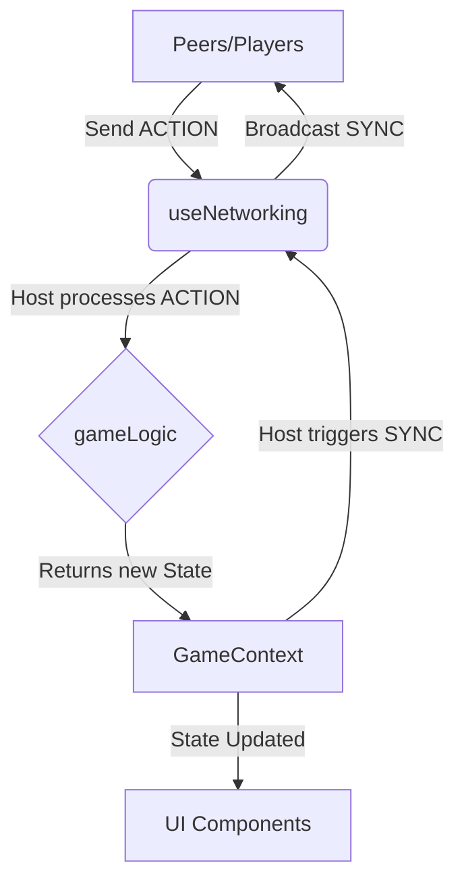

# El-Mahrousa (Egyptian Monopoly)

## Abstract
El-Mahrousa (المحروسة) is a localized, streamlined version of the classic Monopoly game tailored for the Egyptian market. It features Egyptian cities, currency (EGP), and a 24-tile board for faster, more engaging gameplay. The game supports real-time multiplayer over a Peer-to-Peer (P2P) network using WebRTC, allowing players to connect and play directly with each other without a centralized game server.

## How to Play
- **Objective:** Be the last player standing (Bankrupt mode) or accumulate the highest net worth.
- **Roll:** Players roll two dice to move around the board.
- **Act:** Buy unowned properties, pay rent to owners, or trigger special events like "Sodfa" (Chance) or "Hazak" (Luck).
- **Build:** Develop properties with houses and hotels to increase rent, which can only be done when a player owns all properties of a color group.
- **Trade:** Negotiate with other players for properties and cash to complete color sets. Initiate trades at any time before rolling.
- **Bankruptcy:** If a player owes more than their total assets, they are bankrupt. Their assets are transferred to the creditor or auctioned.

## Used Technologies
- **Frontend Framework:** React 18 with TypeScript
- **Build Tool:** Vite
- **Styling:** Tailwind CSS v4
- **Animations:** Framer Motion
- **Networking:** PeerJS (WebRTC for P2P multiplayer)
- **Internationalization:** react-i18next (English & Arabic support)
- **Testing:** Node.js native test runner

## Project Directory Structure

```text
src/
├── assets/          # Static assets (images, svgs)
├── components/      # React UI components (Board, Tile, LoginScreen, TradeModal)
├── config/          # Game configuration and board data definition
├── context/         # React Context providers (GameContext for global state)
├── hooks/           # Custom React hooks (useNetworking for PeerJS logic)
├── locales/         # i18n translation files (ar.json, en.json)
├── logic/           # Core game logic and state transitions (gameLogic.ts)
├── types/           # TypeScript type definitions (game.ts)
├── App.tsx          # Main application component
├── i18n.ts          # Internationalization setup
└── main.tsx         # Application entry point
```

## Software Design & Architecture

The application follows a strictly separated architecture where game logic, network synchronization, and UI rendering are decoupled.

### Main Components
1. **`GameContext` (`src/context/GameContext.tsx`)**: The central state manager. Holds the `GameState`, current player information, and provides the dispatcher functions to mutate the state.
2. **`useNetworking` (`src/hooks/useNetworking.ts`)**: Handles the P2P connection using PeerJS. It manages the creation of lobbies (Host) and joining lobbies (Peers). It broadcasts state updates from the Host to Peers and sends actions from Peers to the Host.
3. **`gameLogic` (`src/logic/gameLogic.ts`)**: Contains pure functions that handle game rules (rolling dice, moving, buying, paying rent, trading). It takes the current `GameState` and an action, returning the new `GameState`.
4. **UI Components (`src/components/`)**:
   - `Board.tsx` / `Tile.tsx`: Renders the game board and player tokens.
   - `LoginScreen.tsx`: Handles the initial lobby creation or joining phase.
   - `TradeModal.tsx`: Manages the complex trading interface.

### Architecture Diagram



*In this Authoritative Host Architecture, the player who creates the lobby acts as the Host. Peers send their intents (actions) to the Host. The Host processes the actions through `gameLogic`, updates the `GameContext`, and broadcasts the new state back to all Peers.*

## Getting Started (Local Development)

### Prerequisites
- Node.js (v20+ recommended)
- pnpm (or npm/yarn)

### Installation & Running
1. Clone the repository:
   ```bash
   git clone <repository-url>
   cd misr-opoly
   ```
2. Install dependencies:
   ```bash
   pnpm install
   ```
3. Start the development server:
   ```bash
   pnpm dev
   ```
4. Open your browser and navigate to `http://localhost:5173`.

## Hosting Your Own PeerJS Server

By default, the game uses the free public PeerJS cloud server for signaling (connecting players). For better reliability, privacy, or offline LAN play, you can host your own signaling server.

### 1. Start the Local Server
You can quickly run a PeerJS server using `npx`:
```bash
npx peerjs --port 9000
```
*This starts a signaling server on `ws://localhost:9000`.*

### 2. Modify the Game Code
To tell the game to use your custom server instead of the public cloud, open `src/hooks/useNetworking.ts`.

Locate the `useEffect` block where the `Peer` instance is created:

```typescript
// Before:
const newPeer = new Peer(myId)
```

Change it to point to your local server. You can also provide a list of ICE candidates (STUN/TURN servers) to help peers connect across complex networks:

```typescript
// After:
const newPeer = new Peer(myId, {
  host: 'localhost', // Or your server's IP address
  port: 9000,
  path: '/',
  config: {
    iceServers: [
      { urls: 'stun:stun.l.google.com:19302' },
      { urls: 'stun:global.stun.twilio.com:3478' }
      // Add TURN servers here if necessary
    ]
  }
})
```
*Note: If you are playing across different networks (not on the same LAN or local machine), you must replace `'localhost'` with the public IP address or domain name of the machine hosting the PeerJS server, and ensure port 9000 is open/forwarded.*